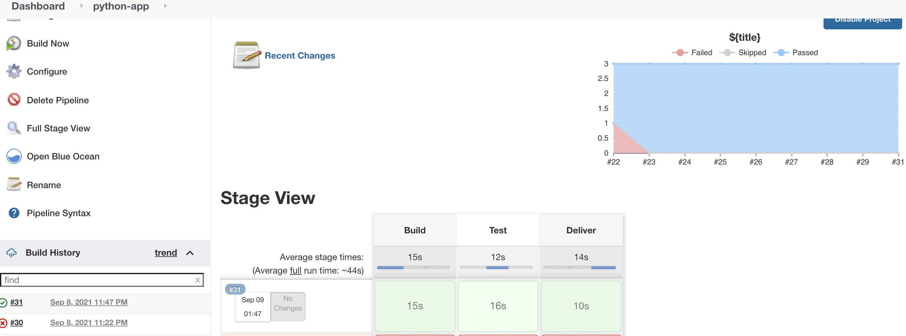

# Jenkins-docker-python

 CI/CD jenkins pipeline implementation for simple python project
 
 # Steps to be followed
 
 1. Pull this repository 
 2. Install Jenkins docker container using docker-compose.yaml file. Spin up jenkins docker container using "docker-compose up -d" command
 3. On terminal write "docker exec -ti -u root jenkins bash" command. Using this we will enter into jenkins container
 4. Type following set of commands to install docker and connect jenkins's docker deamon to docker running on host machine.
    1. apt-get update && apt-get -y install sudo
    2. sudo apt update
    3. sudo apt -y install apt-transport-https ca-certificates curl gnupg2 software-properties-common
    4. curl -fsSL https://download.docker.com/linux/debian/gpg | sudo apt-key add -
    5. sudo add-apt-repository \
        "deb [arch=amd64] https://download.docker.com/linux/debian \
        $(lsb_release -cs) \
        stable"
    6. sudo apt update
    7. sudo apt -y install docker-ce docker-ce-cli containerd.io
    8. sudo gpasswd -a jenkins docker
    9. chmod 777 /var/run/docker.sock

 2. Now browse http://localhost:4000. 
 3. For first time, you will have to setup jenkins server. Refer https://www.jenkins.io/doc/book/installing/docker/ (for setup)
 4. Once Jenkins server is setup, create Jenkinspipeline job. Add gitlab/github credentials from where you would like to pull the source code 
 5. Finally build the pipeline and see the results.
 
 
Format: 
 

